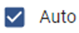
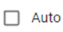
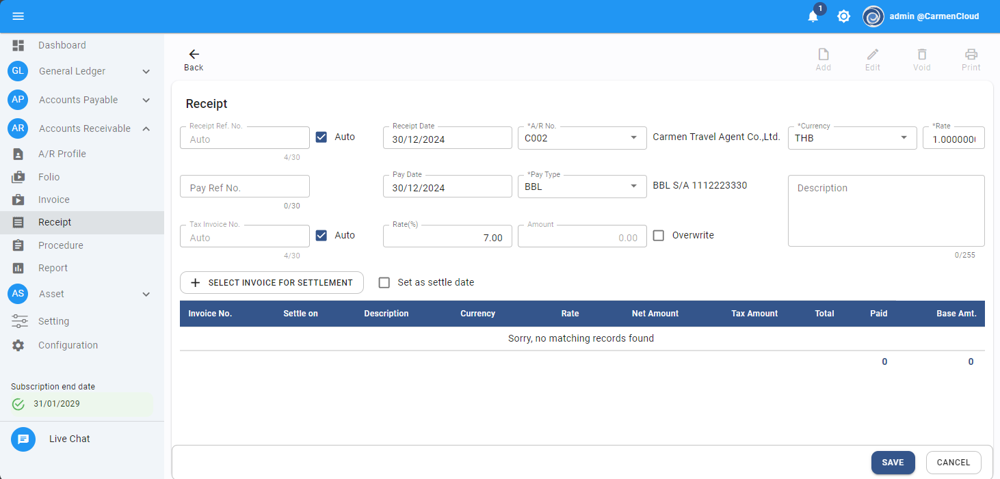
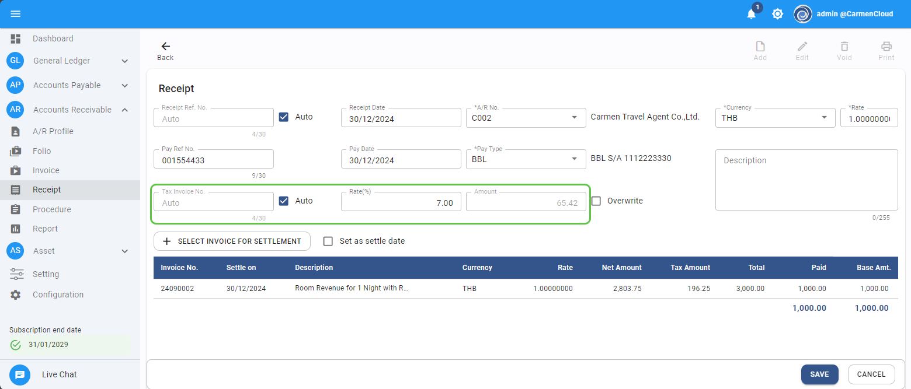
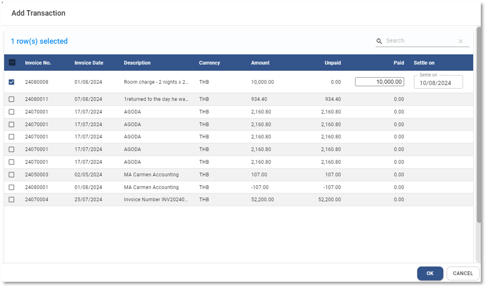
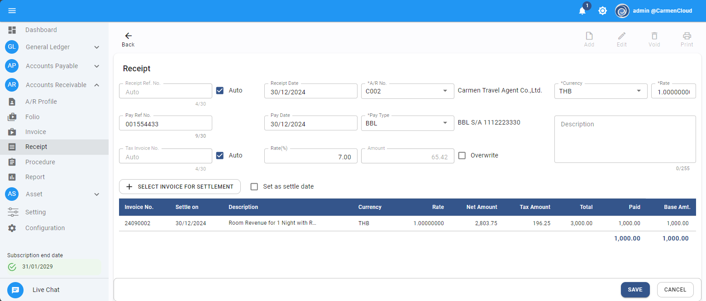
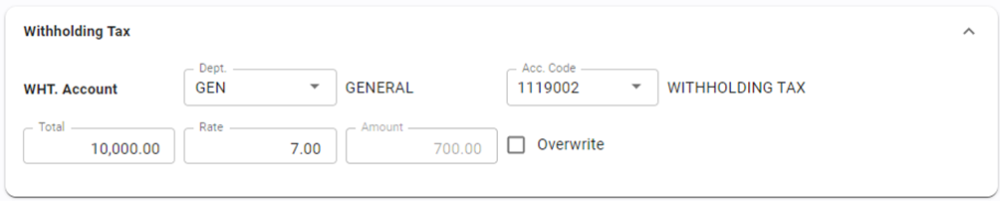
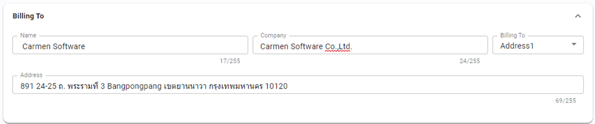
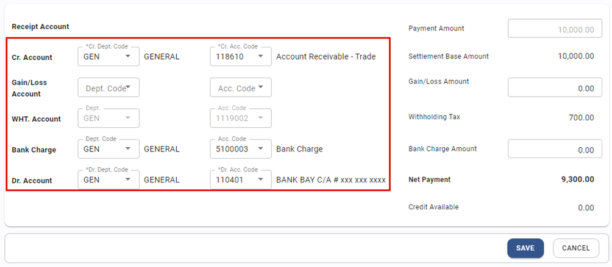
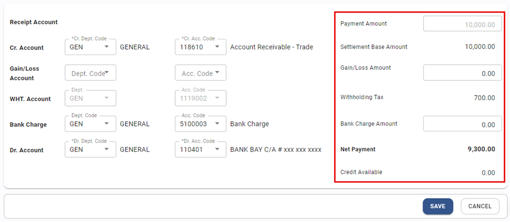

# Receipt

Function นี้ใช้สำหรับการรับชำระหนี้จากลูกหนี้ รวมถึงการออกใบเสร็จรับเงิน และใบกำกับภาษีในระบบ

## การรับชำระหนี้ A/R Receipt

1. Click เข้าสู่ Account Receivable Module

2. เลือกฟังก์ชัน Receipt ระบบจะแสดงหน้าจอ ตามภาพด้านล่าง

3. กดปุ่ม  ระบบจะแสดงหน้า Receipt

4. ให้ผู้ใช้งาน ระบุข้อมูลของ Receipt ดังต่อไปนี้

**หมายเหตุ** เครื่องหมาย \*
(สัญลักษณ์ \* ช่องที่จำเป็นต้องระบุ)

- \* Receipt Ref. No. > กำหนดเลขที่ใบเสร็จรับเงินโดยในระบบสามารถเลือกใช้งานได้ 2 แบบ คือ
  ให้ระบบกำหนดให้อัตโนมัติ โดยการติ๊กเครื่องหมายถูกที่ช่อง 
  ผู้ใช้กำหนดหนดเอง โดยติ๊กเอาเครื่องหมายติ๊กถูกที่ช่อง  ออก
  และพิมพ์เลขที่ใบเสร็จรับเงิน ในช่อง Receipt Ref. No.
- \* Receipt Date > กำหนดวันที่ออกใบเสร็จ
- \* A/R No > กำหนดรหัสลูกหนี้
- \* Currency > กำหนดสกุลเงิน
- \* Rate > อัตราแลกเปลี่ยนเงินตรา
- Pay Ref No. > หมาเลขอ้างอิงเกี่ยวกับการรับชำระ เข่นเลขที่เช็ค
- Pay Date > วันที่ได้รับชำระเงิน
- \* Pay Type > กำหนดประเภทการชําระหนี้เช่น Cash, Cheque หรือ Bank Transfer
- Description > ระบุคำอธิบาย รายละเอียดของใบเสร็จ
- Set as settle date Click เครื่องหมายถูก ☑️ หน้าช่อง กรณีที่ต้องการให้ระบบระบุวันที่
  Settle on (วันที่ตัด Aging) เป็นวันที่เดียวกันกับ วันที่ออกใบเสร็จรับเงิน

  

**กรณีที่ต้องการออกใบกำกับภาษีในใบเสร็จรับเงิน ให้ระบุข้อมูลดังต่อไปนี้**

- Tax Invoice no. > ระบบกำหนดให้อัตโนมัติ โดยการติ๊กเครื่องหมายถูกที่ช่อง Auto 
- Rate (%) > ระบุเปอร์เซ็นต์ร้อยละของฐานภาษีมูลค่าเพิ่ม
- Amount > ยอดภาษีมูลค่าเพิ่ม (ระบบจะคำนวณจาก Paid amount ให้อัตโนมัติ)
  ในกรณีต้องการแก้ไข ภาษีมูลค่าเพิ่ม ให้ติ๊กเครื่องหมายถูกที่ช่อง Overwrite และพิมพ์ยอดภาษีมูลค่าเพิ่มที่ช่อง Amount

5. ขั้นตอนการเลือก Invoice เพื่อมารับชำระ โดยกดปุ่ม  SELECT INVOICE FOR SETTLEMENT

6. ระบบจะแสดงหน้าต่างให้เลือกรายการ Invoice ที่จะรับชำระ โดยทำตามขั้นตอนดังต่อไปนี้

- ติ๊กเครื่องหมายถูก ☑️ หน้า Invoice ที่จะรับชำระ
- ตรวจสอบยอดที่จะรับชำระที่ช่อง Paid กรณีต้องการชำระบางส่วน ให้คีย์ยอดลงไปที่ช่องนี้
- Settle on ใช้กำหนดวันที่ต้องการตัดยอดลูกหนี้ (Aging)
- เมื่อเลือกครบแล้วให้กดปุ่ม **OK** ด้านล่าง หรือกด Cancel เพื่อยกเลิก
- สามารถค้นหาเลข invoice ที่ต้องการได้ในช่อง Search 
- หากต้องการเลือก invoice ทุกใบสามารถกดถูกที่หัว column 

- ระบบจะดึงรายการไปแสดงในหน้าจอหลัก

## การบันทึกภาษีหัก ณ ที่จ่าย 

7. ในกรณีต้องการบันทึกรายการภาษี หัก ณ ที่จ่าย With Holding Tax ให้เลื่อนหน้าจอลงมา

7.1 Click ที่ช่อง Withholding Tax โดยกรอกรายละเอียดการบันทึกข้อมูล ดังต่อไปนี้

- Dept. > กำหนด Department Code จะใช้บันทึกบัญชี
- Acc. Code > กำหนด Account Code จะใช้บันทึกบัญชีภาษีหัก ณ ที่จ่าย
- Total > ระบุยอดที่จะนำไปคำนวณภาษีหัก ณ ที่จ่าย
- Rate > ระบุเปอร์เซ็นต์ ภาษีหัก ณ ที่จ่าย
- Amount > ยอดภาษี หัก ณ ที่จ่าย ระบบจะคำนวณให้อัตโนมัติ
- Overwrite > ติ๊กเครื่องหมายถูก ☑️ กรณีที่ต้องการแก้ไขยอดภาษีหัก ณ ที่จ่าย
  แล้วให้ผู้ใช้งานพิมพ์ยอดภาษี หัก ณ ที่จ่าย ที่ช่อง Amount

8. ตรวจสอบ ชื่อ และ ที่อยู่ ในการออกใบเสร็จรับเงิน/ใบกำกับภาษี โดยการ Click ที่ช่อง Billing to และตรวจสอบข้อมูลดังต่อไปนี้

- Name > ชื่อ สกุล กรณีต้องการออกใบเสร็จรับเงิน หรือ ใบเสร็จรับเงิน/ใบกำกับภาษีในนามบุคคล
- Company > ชื่อบริษัท ที่ต้องการออกใบเสร็จรับเงิน หรือ ใบเสร็จรับเงิน/ใบกำกับภาษี
- Billing To > ระบบจะกำหนดที่อยู่ตามการตั้งค่าเบื้องต้นจาก AR Profile หรือเลือกที่อยู่อื่นมาใช้แทนได้
- Address > ที่อยู่ที่ต้องการออกใบเสร็จรับเงิน หรือ ใบเสร็จรับเงิน/ใบกำกับภาษี โดยระบบจะแสดงที่อยู่ตามที่ตั้งค่าเบื้องต้น

9. กำหนด Account code ในส่วนของ Receipt Account (ในกรณีที่ลูกหนี้ชำระค่าบริการ จำเป็นต้องระบุ Payment Account Code เพื่อส่งขอมูลการชำระเงินในส่วนของ AR ไปยังระบบ General Ledger) โดยมีขั้นตอนดังต่อไปนี้

**หมายเหตุ** เครื่องหมาย \*
(สัญลักษณ์ \* ช่องที่จำเป็นต้องระบุ)

9.1 Cr. Account กำหนดรหัสผังบัญชี ที่จะใช้บันทึกบัญชีลดลูกหนี้ (Aging)

- \* Cr Dept. Code > กำหนด Department Code
- \* Cr Acc. Code > กำหนด Account Code

9.2 Gain/Loss Account กำหนดรหัสบัญชีที่จะใช้บันทึกกำไรขาดทุนจากอัตราแลกเปลี่ยนเมื่อรับชำระเงินด้วยสกุลเงินอื่น (หากมี ต้องระบุ)

- Dept. Code > กำหนด Department Code จะใช้บันทึกบัญชี
- Acc. Code > กำหนด Account Code จะใช้บันทึกบัญชี

9.3 Bank Charge Account กำหนดรหัสบัญชีที่จะใช้บันทึกยอด Bank Charge (หากมี ต้องระบุ)

- \* Dept. Code > กำหนด Department Code จะใช้บันทึกบัญชี
- \* Acc. Code > กำหนด Account Code จะใช้บันทึกบัญชี

9.4 Dr. Account กำหนดรหัสบัญชีที่จะใช้บันทึกตามวิธีการรับชำระเงินเช่น Cash, Bank หรือ Cheque

- \* Dr Dept. Code > กำหนด Department Code
- \* Dr Acc. Code > กำหนด Account Code

10. ตรวจสอบยอดที่แสดงในส่วนของ Summary ด้านล่าง ขวามือ

- Payment Amount > ยอดเงินรวมที่ได้รับชำระ
- Settlement Base Amount > ยอดเงินรวมที่ได้รับชำระ แปลงตามสกุลเงินหลัก (Base Currency)
- Gain/Loss > ยอดกำไรขาดทุนจากอัตราแลกเปลี่ยน
- Withholding Tax > ยอดที่ถูกหักภาษีหัก ณ ที่จ่าย
- Bank Charge > ระบุยอด Bank Charge ที่ถูกหัก
- Net Payment > ยอดสุทธิ ที่ได้รับชำระ
- Credit Available > จำนวนเงินคงเหลือในกรณีที่รับชำระเงินล่วงหน้า

11. กดปุ่ม **SAVE** เพื่อบันทึกข้อมูล

12. กด **OK** เพื่อเสร็จสิ้นขั้นตอน

    

Video ประกอบ

<h3 style="margin: 0;">Receipt | การสร้างใบเสร็จรับเงิน</h3>

<iframe width="560" height="315" src="https://www.youtube.com/embed/2Wxfv97HItY?si=r8wZ-Sf3QECZ3rZo" title="YouTube video player" frameborder="0" allow="accelerometer; autoplay; clipboard-write; encrypted-media; gyroscope; picture-in-picture; web-share" referrerpolicy="strict-origin-when-cross-origin" allowfullscreen></iframe>

<iframe width="560" height="315" src="https://www.youtube.com/embed/wNn4pvV8_68?si=6jj5rvYviTHqSk7M" title="YouTube video player" frameborder="0" allow="accelerometer; autoplay; clipboard-write; encrypted-media; gyroscope; picture-in-picture; web-share" referrerpolicy="strict-origin-when-cross-origin" allowfullscreen></iframe>