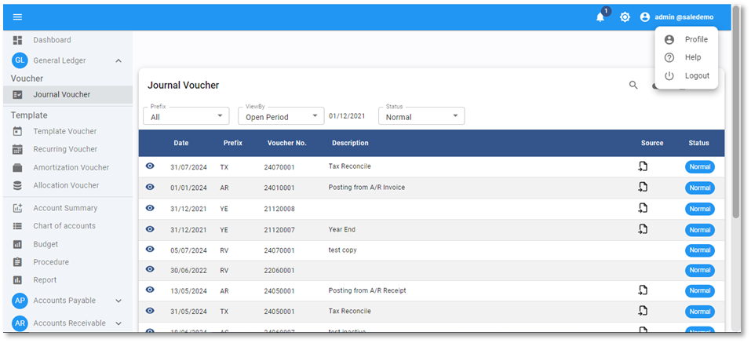
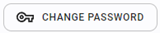
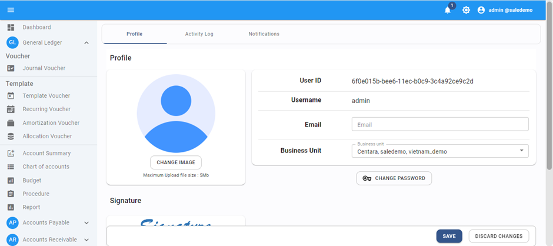
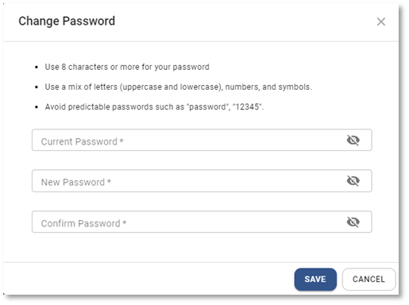

# Users-How To Change User and Password

การแก้ไข User name และ Password

1. Click ที่ชื่อที่ login

2. กด Profile

3. กด  เพื่อเปลี่ยน Password

4. ทำการเปลี่ยน Password

- ใส่ Password เก่า
- กำหนด Password ใหม่
- ยืนยัน Password ใหม่

5. กด **SAVE** เพื่อยืนยัน หรือ Cancel เพื่อยกเลิก

    

