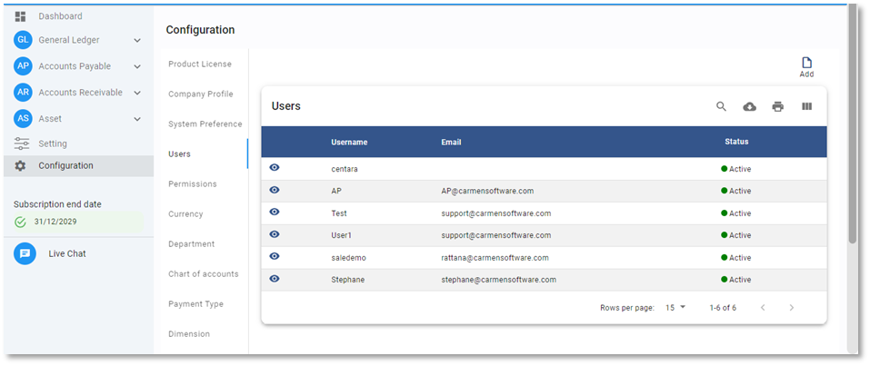
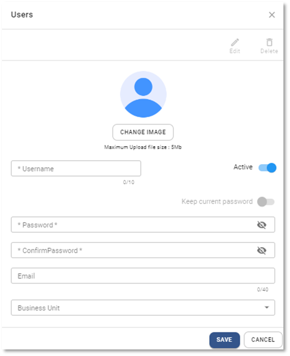

# Users

ขั้นตอนการสร้าง User & Password
Function นี้ใช้สร้าง user name และ Password เข้าใช้งานระบบ
ขั้นตอนการสร้าง User และ Password

1. Click เมนู Configuration

2. เลือกที่ User

3. กดปุ่ม Add  ด้านบน ขวามือ

4. ให้กำหนดข้อมูล ดังต่อไปนี้

- \* User Name กำหนด User Name > ที่จะใช้ Log In เข้าระบบ
- Status > กำหนด Status ของ Unit
   Active > เปิดให้ใช้งาน
   Inactive > ปิดไม่ให้ใช้งาน
- \* Password > กำหนด Password ที่จะใช้ Log In เข้าระบบ โดยต้องใช้
  ความยาวอย่างน้อย 8 ตัวอักษรหรือมากกว่านั้น
  ประกอบด้วยอักขระดังต่อไปนี้
  ตัวอักษร (a-z, A-Z) ตัวเลข (0-9)
  เครื่องหมายหรืออักขระพิเศษ (!@#$%^&\*()\_+|~-=\`{}[]:”;'<>?,./)
- \* Confirm Password > ยืนยัน Password อีกครั้ง
- Email > อีเมล
- Business unit > กำหนด Business Unit ที่ให้ User มีสิทธิเข้าใช้งาน
- เรียบร้อยแล้วกดปุ่ม **SAVE** เพื่อบันทึกข้อมูล

