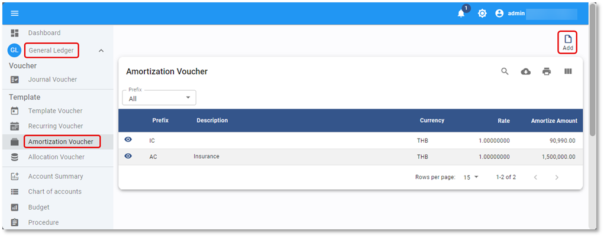
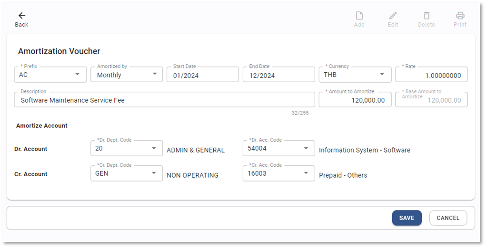
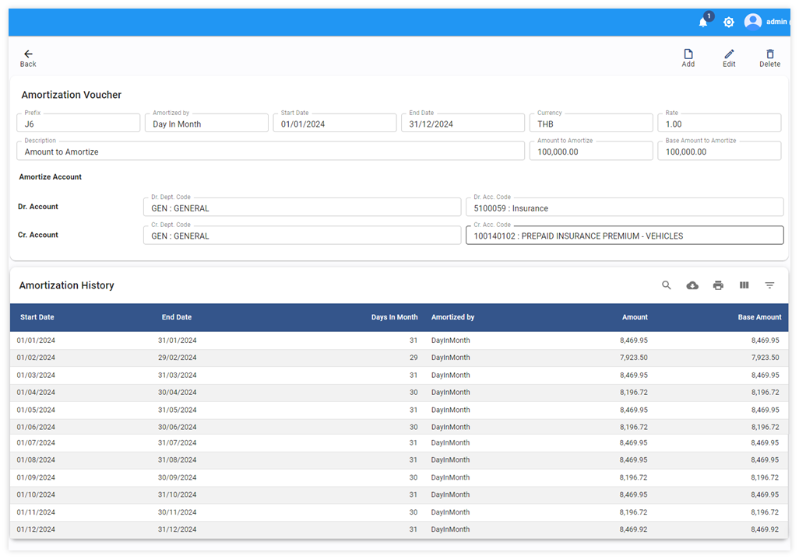
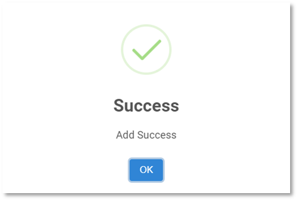
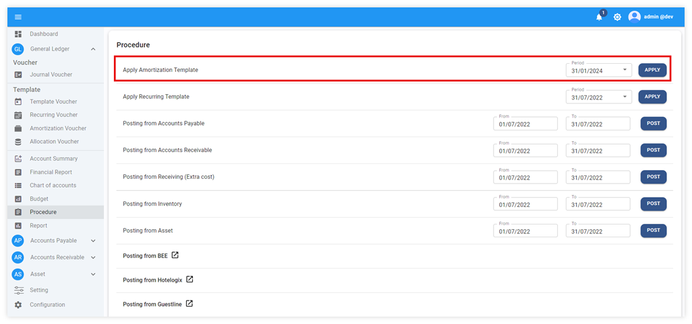
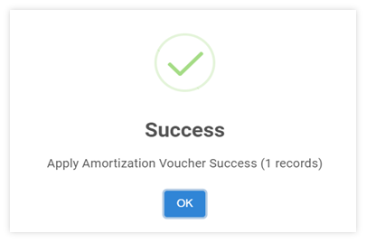
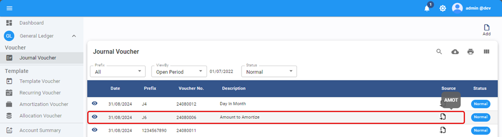
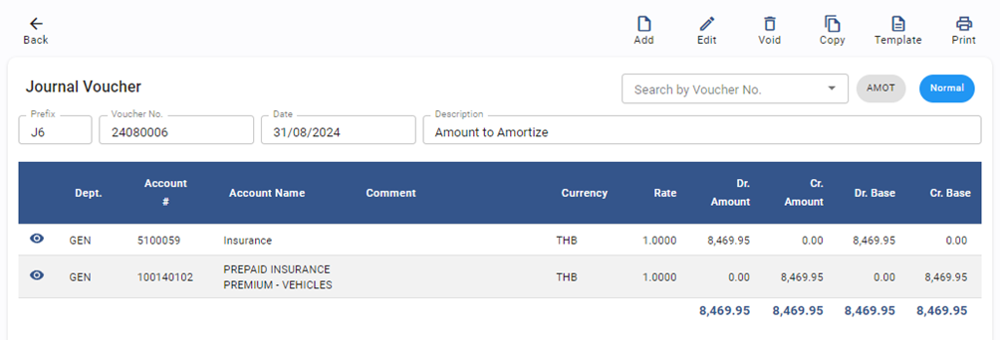

# Amortization Voucher

Function นี้ใช้เพื่อสร้างแม่แบบเอกสารเพื่อบันทึกค่าใช้จ่าย และล้างค่าใช้จ่ายจ่ายล่วงหน้า (Prepaid Expense)เช่นค่าบริการรายปีต่าง ๆ โดยอัตโนมัติ

## การสร้าง Amortization Voucher

1.1. Click เข้าสู่ General Ledger Module

1.2. Click เลือก Amorization Voucher

1.3. กดปุ่ม 

1.4. ระบบจะแสดงหน้า Amortization Voucher ให้กำหนดค่าดังต่อไปนี้

**หมายเหตุ** เครื่องหมาย \*
(สัญลักษณ์ \* ช่องที่จำเป็นต้องระบุ)

- \* Prefix > กำหนดประเภทสมุดบัญชีที่ต้องการสร้าง Template
- Amortized by > กำหนดวิธีการคำนวณสมุดบัญชี โดยมีอยู่ 2 วิธีในการคำนวณ ดังนี้

  - Day In Month > ใช้วิธีคำนวณโดย (จำวนเงิน ÷ จำนวนวันจาก Start Date ถึง End Date) x จำนวนวันในเดือนนั้นๆ
  - Monthly > ใช้วิธีคำนวณโดย จำนวนเงิน ÷ จำนวนเดือนจาก Start Date ถึง End Date
    ทั้ง 2 วิธีจะบันทึกบัญชีเป็น JV 1 ใบต่อเดือนด้วยจำนวนเงินที่แตกต่างกัน

- \* Currency > สกุลเงิน
- \* Rate > อัตราแลกเปลี่ยน
- Start Date > กำหนด Period เริ่มต้นที่จะ Apply Recurring
- End Date > กำหนด Period สุดท้ายที่จะ Apply Recurring
- Description > รายละเอียด Template
- Amount to Amortize > มูลค่ารวมของค่าใช้จ่ายจ่ายล่วงหน้า

---

1.4.1. ตัวอย่างการตั้งค่าแบบ Monthly

1.4.2. ตัวอย่างการตั้งค่าแบบ Day In Month

1.5. เมื่อกำหนดค่าเอกสารเสร็จให้กด

1.6. กด **OK** เพื่อเสร็จสิ้นขั้นตอน

    

1.7. เมนูคำสั่งอื่นที่เกี่ยวข้อง

 สร้างเอกสารแม่แบบ

 แก้ไขเอกสารแม่แบบ

 การยกเลิกเอกสารแม่แบบ

 พิมพ์เอกสาร

## การใช้งาน JV Template ประเภท Amortization Voucher

2.1. Click เข้าสู่ General Ledger Module

2.2. กดปุ่ม Procedure

2.3. กำหนด Period  ที่ต้องการในหัวข้อ Apply Amortization Template

2.4. Click **APPLY** เพื่อให้ระบบ Generate JV ตาม Amortized Voucher ที่ได้กำหนดไว้

2.5. เมื่อระบบทำการ Apply JV เรียบร้อยแล้วจะขึ้นหน้าต่างแสดงจำนวนสมุดบัญชีที่ถูกสร้างขึ้นในรอบบัญชีนี้

2.6. หลังจากบันทึกข้อมูล ระบบจะแสดงหน้าต่างผลการบันทึกข้อมูล

    

## การตรวจสอบ JV ที่ถูกสร้างจากการ Apply Amortization Voucher

3.1. Click เข้าสู่ General Ledger Module

3.2. Click Journal Voucher

3.3. Journal Voucher ที่แสดง Source

3.4. Click สัญลักษณ์  ที่ JV ที่ต้องการดูรายละเอียด

3.5. ตัวอย่างรายละเอียดของ JV ที่สร้างจากการ Apply Amortization Voucher โดยอัตโนมัติ

การใช้งานปุ่มอื่น ๆ บนหน้าจอ

4.1 กดปุ่ม  เพื่อค้นหา Amortization Voucher

4.2 กดปุ่ม  เพื่อ Export ข้อมูลออกจากระบบเป็น .csv

4.3 กดปุ่ม  เพื่อพิมพ์ข้อมูล

Video ประกอบ

<h5 style="margin: 0;">Amortization Voucher | การสร้างใบสำคัญบันทึกบัญชีแบบตั้งค่าตัดจำหน่ายตามระยะเวลา
</h5>

<iframe width="560" height="315" src="https://www.youtube.com/embed/QZHfIB1hFa4?si=aVvrRHq2aDDbc4eE" title="YouTube video player" frameborder="0" allow="accelerometer; autoplay; clipboard-write; encrypted-media; gyroscope; picture-in-picture; web-share" referrerpolicy="strict-origin-when-cross-origin" allowfullscreen></iframe>

<iframe width="560" height="315" src="https://www.youtube.com/embed/xuAYQVXXMeI?si=X6JRw5ZJZSw2JtSi" title="YouTube video player" frameborder="0" allow="accelerometer; autoplay; clipboard-write; encrypted-media; gyroscope; picture-in-picture; web-share" referrerpolicy="strict-origin-when-cross-origin" allowfullscreen></iframe>