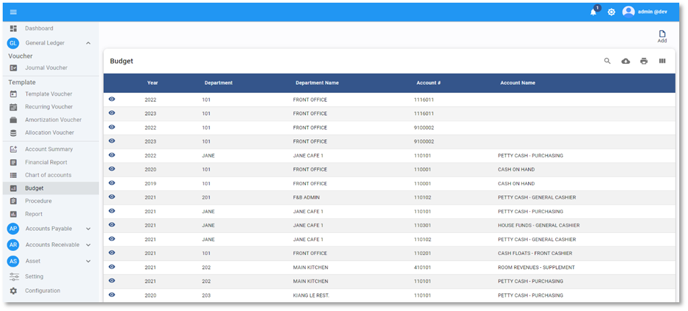
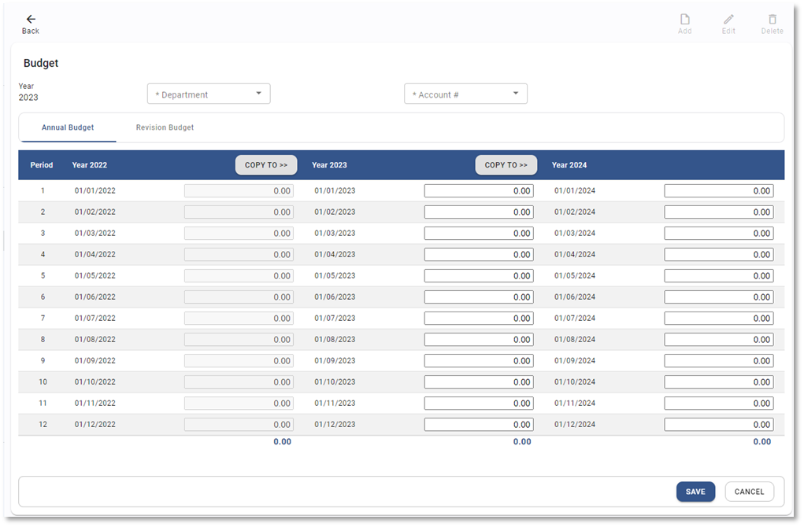
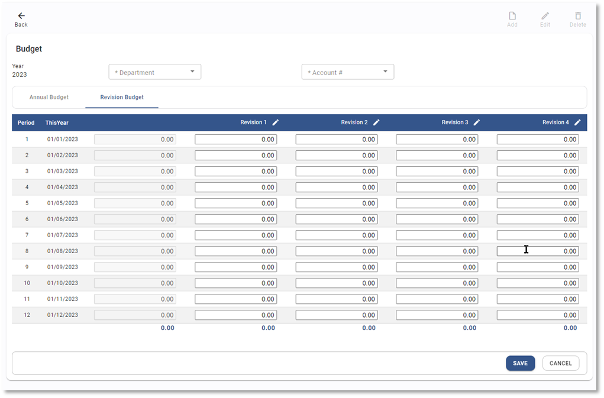

# Budget

**Budget Forecast** คือ การประมาณการงบประมาณทั้งรายได้และค่าใช้จ่ายที่จะเกิดขึ้นทั้งปี เพื่อบริหารจัดการรายได้ให้ได้ตามเป้าหมายที่วางไว้ และเป็นการควบคุมค่าใช้จ่ายให้ได้ตามที่กำหนดไว้ตามแผนการบริหาร

## การบันทึก Budget ในระบบ

1.1. Click เข้าสู่ General Ledger Module

1.2. เลือกฟังก์ชัน Budget

1.3. กดปุ่ม 

1.4. ระบบจะแสดงหน้า Budget ให้กำหนดค่าดังต่อไปนี้

**หมายเหตุ** เครื่องหมาย \*
(สัญลักษณ์ \* ช่องที่จำเป็นต้องระบุ)

- \* Department > กำหนดแผนกที่ต้องการป้อนข้อมูล
- \* Account# > กำหนดรหัสบัญชีที่ต้องการป้อนข้อมูล
- Period > รอบปีงบประมาณ
- Number > กำหนดจำนวน Budget ต่อเดือน และบันทึกเป็นรายปี

---

1.5. กดปุ่ม  เพื่อ copy ตัวเลข Budget จากปีก่อนหน้า

1.6. กดปุ่ม **SAVE** เพื่อบันทึกข้อมูลเข้าระบบ

## การบันทึก Revision Budget

ใช้บันทึกในกรณีที่มีการปรับปรุง Budget แตกต่างจาก Budget หลัก โดยสามารถบันทึกได้สุงสุด 4 Revision

เมนูคำสั่งอื่นที่เกี่ยวข้อง

 สร้าง Budget

 แก้ไข Budget

 การลบ Budget

Video ประกอบ

<h3 style="margin: 0;">Budget | การบันทึกงบประมาณ</h3>

<iframe width="560" height="315" src="https://www.youtube.com/embed/DobgUMZ6_EE?si=pD9WSwOqgFEOuxdY" title="YouTube video player" frameborder="0" allow="accelerometer; autoplay; clipboard-write; encrypted-media; gyroscope; picture-in-picture; web-share" referrerpolicy="strict-origin-when-cross-origin" allowfullscreen></iframe>

<iframe width="560" height="315" src="https://www.youtube.com/embed/td1iJu4ifzs?si=ETT6j7SwTXGrIV6g" title="YouTube video player" frameborder="0" allow="accelerometer; autoplay; clipboard-write; encrypted-media; gyroscope; picture-in-picture; web-share" referrerpolicy="strict-origin-when-cross-origin" allowfullscreen></iframe>